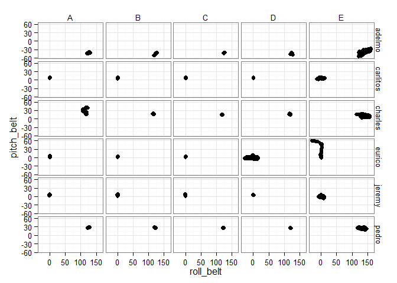
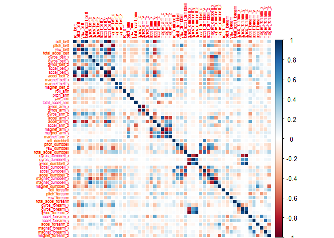

## Introduction

## Data cleaning and preparation

As a first step in the analysis, we load and clean the data. About two thirds of the variables in the dataset contain mostly missing values, which were removed. A number of variables relating to the timing of the exercises were also removed, since the documentation on how to interpret these varibles was incomplete.

Although the dataset was already divided into a training and a testing set, the training set was deemed large enough to be split into training and a validation sets (using an 80/20 split). Creating a validation set allowed me to get a more accurate estimate of the test set error rate than I would using only cross-validation on the original training set.

As a final step in the preparation, all variables were scaled and centered, primarily to allow for easier plotting, but also since some ML algorithms need/prefer the data to be thus transformed.


```r
library(dplyr)
library(reshape2)
library(ggplot2)
library(caret)

# Load data
training <- read.csv("./data/pml-training.csv", stringsAsFactors = FALSE) %>% tbl_df
testing <- read.csv("./data/pml-testing.csv", stringsAsFactors = FALSE) %>% tbl_df

training$set <- "train"
testing$set <- "test"
classe <- training$classe
problem_id <- testing$problem_id
testing$problem_id <- NULL

full <- rbind(select(training, -classe), testing)

# Remove variables with mostly NAs
naCols <- apply(full, 2, function(x) sum(is.na(x)))
full <- full[-which(naCols > 0)]

# Remove variables not related to instrument readings
full <- full[-c(1, 3:7)]

# Re-split into training and testing sets
train <- full[full$set == "train",]
test <- full[full$set == "test",]

train$classe <- classe
test$problem_id <- problem_id
rm(full)

# Create training and validation set
index <- createDataPartition(train$classe, p = 0.8, list = FALSE)

train2 <- train[index,]
valid <- train[-index,]

# Remove variables with near-zero variance
nzv <- nearZeroVar(train2)
train2 <- train2[,-nzv]
valid <- valid[,-nzv]
test <- test[,-nzv]

# Scale and center the data
scale_center <- preProcess(select(train2, -classe, -user_name), 
                           method = c("scale", "center"))

train_scaled <- predict(scale_center, select(train2, -classe, -user_name))
train_scaled$classe <- train2$classe

valid_scaled <- predict(scale_center, select(valid, -classe, -user_name))
valid_scaled$classe <- valid$classe

train_scaled$classe <- factor(train_scaled$classe)
valid_scaled$classe <- factor(valid_scaled$classe)
train_scaled$user_name <- factor(train2$user_name)
valid_scaled$user_name <- factor(valid$user_name)
```

## Exploratory data analysis 

To get a feel for what the data looked like, a large number of graphs were produced. Figure X, for example, gives a first indication that the different classes are quite well-separated (we should thus expect a relatively high accuracy rate). 


```r
qplot(data=train, roll_belt, pitch_belt, facets=user_name~classe)
```

 


```r
library(corrplot)
train2[-c(1,54)] %>% 
  cor %>% 
  corrplot(method = "color", tl.cex = 0.5)
```

 

## Training a model

A large number of standard ML models were fit to the data. However, due to computational considerations, only the most promising type of model -- the stochastic gradient boosting model (gbm) -- is documented here. The other models tested included linear discriminant analysis, a support vector machine with radial kernel, recursive partitioning tree, and random forests. Using the standard tuning length in the ```caret``` package, they all had CV-estimated accuracies in the .7-.8 range. 

The gbm model was tuned using all three tuning parameters (number of trees, the interaction depth, and the shrinkage factor), and each model was evaluted using 10-fold cross-validation. 


```r
# Train models
trc <- trainControl("cv")

# gbmGrid <- expand.grid(n.trees = seq(50, 500, 50), 
#                         interaction.depth = 1:5,
#                         shrinkage = c(0.1, 0.01))

# gbm_valid <- train(y = train_scaled$classe, x = train_scaled[-53], 
#              method = "gbm", 
#              trControl = trc, 
#              tuneGrid = gbmGrid, 
#              verbose = TRUE)
load(file = "gbm_model.RData")
gbm_valid <- gbm
```

The final model had a CV-estimated accuracy of 0.964 and the optimal tuning parameters were chosen as 150 trees, an interaction depth of 3, and a shrinkage parameter of 0.1.

## Evaluating the model

To estimate the out-of-sample error rate of the model, predictions for the validation set for calculated and compared against the ground truth in a confusion matrix.


```r
(confMat <- confusionMatrix(predict(gbm_valid, valid_scaled[-53]), valid_scaled$classe))
```

```
## Loading required package: gbm
## Loading required package: parallel
## Loaded gbm 2.1
```

```
## Confusion Matrix and Statistics
## 
##           Reference
## Prediction    A    B    C    D    E
##          A 1105   29    0    6    0
##          B    7  680   19   14    8
##          C    4   45  653   42   16
##          D    0    2   11  578    9
##          E    0    3    1    3  688
## 
## Overall Statistics
##                                         
##                Accuracy : 0.944         
##                  95% CI : (0.937, 0.951)
##     No Information Rate : 0.284         
##     P-Value [Acc > NIR] : <2e-16        
##                                         
##                   Kappa : 0.929         
##  Mcnemar's Test P-Value : NA            
## 
## Statistics by Class:
## 
##                      Class: A Class: B Class: C Class: D Class: E
## Sensitivity             0.990    0.896    0.955    0.899    0.954
## Specificity             0.988    0.985    0.967    0.993    0.998
## Pos Pred Value          0.969    0.934    0.859    0.963    0.990
## Neg Pred Value          0.996    0.975    0.990    0.980    0.990
## Prevalence              0.284    0.193    0.174    0.164    0.184
## Detection Rate          0.282    0.173    0.166    0.147    0.175
## Detection Prevalence    0.291    0.186    0.194    0.153    0.177
## Balanced Accuracy       0.989    0.940    0.961    0.946    0.976
```

The confusion matrix suggests that class B was the most problematic to predict. Still, the accuracy rate of 
0.944 was promising. 

## Making predictions

Finally, a model identical to the one found above was fit to the entire training set (i.e. including the 3000 or so observations in the validation set not used to fit the previous model). The model was then used to predict the 20 classes in the original training set. 


```r
scale_center_final <- preProcess(select(train, -classe, -user_name, -set), 
                           method = c("scale", "center"))
train_scaled_final <- predict(scale_center_final, select(train, -classe, -user_name, -set))
train_scaled_final$classe <- train$classe
train_scaled_final$user_name <- factor(train$user_name)

test_scaled <- predict(scale_center_final, select(test, -problem_id, -user_name))
test_scaled$problem_id <- test$problem_id
test_scaled$user_name <- factor(test$user_name)
```


```r
# Train model using optimal tuning params from cross-validated earlier model
trc <- trainControl("cv")

gbmGrid_final <- data.frame(n.trees = gbm_valid$finalModel$n.trees, 
                        interaction.depth = gbm_valid$finalModel$interaction.depth,
                        shrinkage = gbm_valid$finalModel$shrinkage)

# gbm_final <- train(y = train_scaled_final$classe, x = train_scaled_final[-53], 
#              method = "gbm", 
#              trControl = trc, 
#              tuneGrid = gbmGrid_final, 
#              verbose = TRUE)
```


```r
# source("write_answers.R")
# answers <- predict(gbm_final, select(test_scaled, -problem_id))
```

## Conclusion
